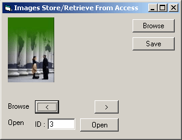



## Easy Image Retrieve/Store to Access

### Description

An easy approach to saving images to database , displaying them, even save to file and search and display relevant images from database.
 
### More Info
 
this is just a demonstration. you have all rights to edit, redistribute or use the code.

             |
---                |---
**Submitted On**   |2005-09-19 05:30:04
**By**             |[salman ansari](https://github.com/Planet-Source-Code/PSCIndex/blob/master/ByAuthor/salman-ansari.md)
**Level**          |Beginner
**User Rating**    |4.3 (13 globes from 3 users)
**Compatibility**  |VB 6\.0
**Category**       |[Databases/ Data Access/ DAO/ ADO](https://github.com/Planet-Source-Code/PSCIndex/blob/master/ByCategory/databases-data-access-dao-ado__1-6.md)
**World**          |[Visual Basic](https://github.com/Planet-Source-Code/PSCIndex/blob/master/ByWorld/visual-basic.md)
**Archive File**   |[Easy\_Image1933659192005\.zip](https://github.com/Planet-Source-Code/salman-ansari-easy-image-retrieve-store-to-access__1-62608/archive/master.zip)

